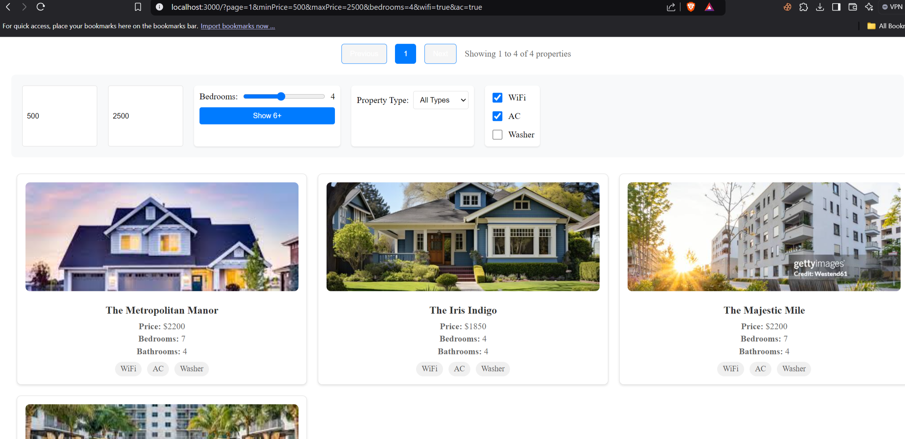
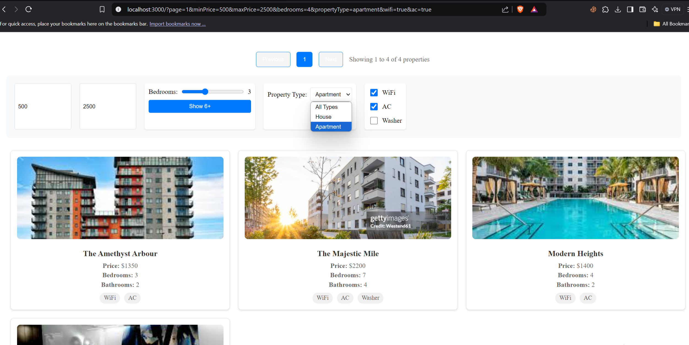

# Property Listing Application with Filters and Pagination

A full-stack application for property listings with advanced filtering and pagination capabilities.

## Screenshots

### Main View with Filters

*Property listing page showing the filter panel and property grid*

### Filter Results

*Example of filtered results showing properties with specific amenities*

## Features

- Property listing with images and details
- Advanced filtering system:
  - Price range (min/max)
  - Number of bedrooms (including 6+ option)
  - Property type (house/apartment)
  - Amenities (WiFi, AC, Washer)
- Pagination with URL state management
- Responsive grid layout
- Server-side filtering
- URL-based state persistence

## Tech Stack

### Frontend
- React
- Axios for API calls
- CSS for styling

### Backend
- Express.js
- CORS middleware
- Static file serving

## Setup

1. Clone the repository:
```bash
git clone https://github.com/MarsX-2002/pagination-filter.git
```

2. Install dependencies:
```bash
# Install server dependencies
cd server
npm install

# Install client dependencies
cd ../temp-client
npm install
```

3. Start the application:
```bash
# Start server (from server directory)
npm start

# Start client (from temp-client directory)
npm start
```

4. Access the application at `http://localhost:3000`

## Project Structure

- `/server` - Backend Express.js server
- `/temp-client` - Frontend React application
- `/public` - Static assets (images)

## API Endpoints

- `GET /properties` - Get filtered and paginated properties
  - Query parameters:
    - `page`: Page number
    - `limit`: Items per page
    - `minPrice`: Minimum price
    - `maxPrice`: Maximum price
    - `bedrooms`: Number of bedrooms
    - `propertyType`: Type of property
    - `wifi`: WiFi availability
    - `ac`: AC availability
    - `washer`: Washer availability
